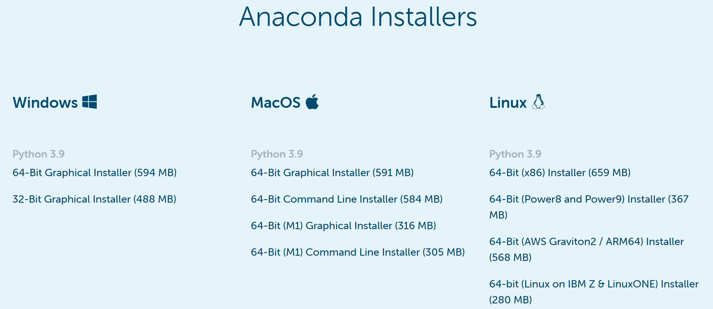
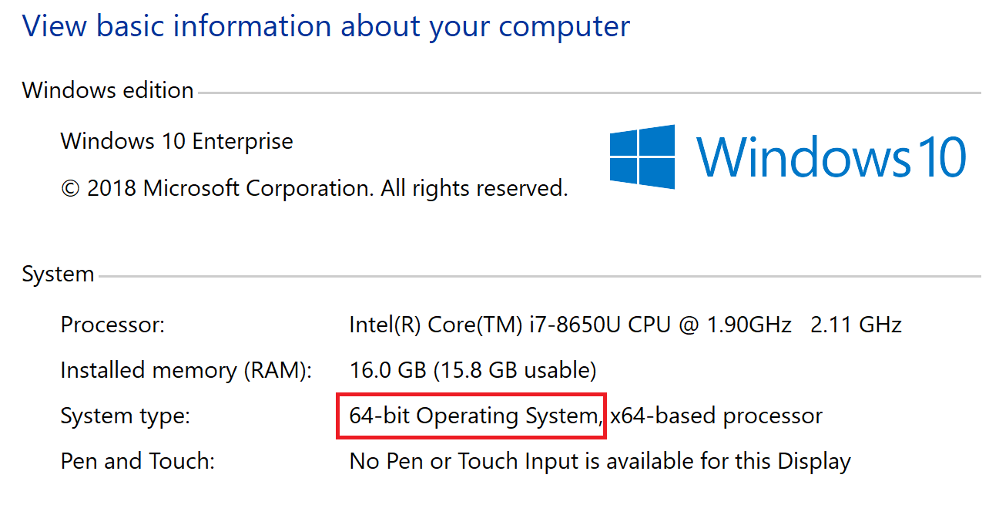
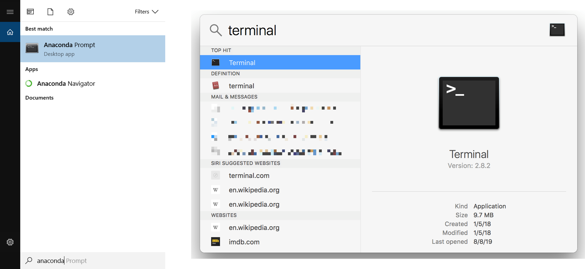
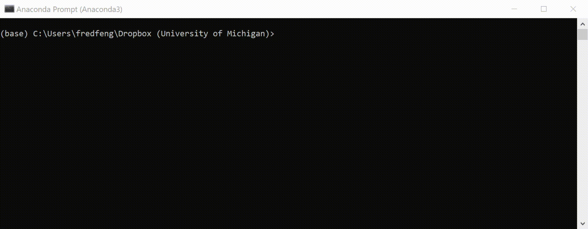
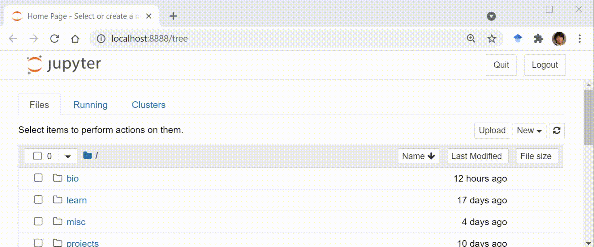

# Installing Anaconda & launching Jupyter Notebook

We will use Anaconda, a common Python distribution bundled with other popular tools. 

## Download

Go to the [Anaconda download page](https://www.anaconda.com/products/individual#Downloads).

Download the installer that matches your operating system.

**Windows users**: If you are not sure whether it's 64-bit (most likely) or 32-bit (uncommon), 
go to the search bar (the magnifying glass 🔎 in the lower left corner), 
type in `this PC`, then right-click on it, and then select *Properties*. 
The new window (see below) will give you the information under *System type*.  

## Install

**Windows/Mac users**

- Double-click the downloaded file to start the installation. 

- Use all of the defaults for installation except make sure to check *Make Anaconda the default Python*.

**Linux users**

- Open a terminal window.
- Type `bash Anaconda-` and then press tab. The name of the file you just downloaded should appear. Press <kbd>Enter</kbd>
- You will follow the text-only prompts. When there is a colon at the bottom of the screen, press the down arrow to move down through the text. 
    - Type `yes` and press <kbd>Enter</kbd> to approve the license. 
    - Press <kbd>Enter</kbd> to approve the default location for the files. 
    - Type `yes` and press <kbd>Enter</kbd> to add Anaconda to your PATH (this makes Anaconda the default Python).

## Launch Jupyter Notebook

First, you will need to launch your operating system's command-line interface. 

- **Windows**: go to the search bar, type in `anaconda prompt`, and press <kbd>Enter</kbd>
- **Mac**: go to the Spotlight Search (the magnifying glass icon), type in `terminal`, and press <kbd>return</kbd>.
- **Linux**: go to the search bar, type in `terminal`, and press <kbd>Enter</kbd>.

In the command-line interface, type in `jupyter notebook` , and press <kbd>Enter</kbd> (Windows/Linux) or <kbd>return</kbd> (Mac).

This should automatically launch Jupyter Notebook with your default web browser. 

If not, copy and paste the URL from the window (starting with `http://localhost:8888/`) to a web browser, and press <kbd>Enter</kbd>.

Web browser recommendations: Chrome, Safari, Firefox.

Now you should see the Jupter Notebook dashboard in your browser (see the image below). 
You can navigate the directory to a desired folder, and then create a new notebook file by clicking the **New** ▼ dropdown button, and then **Python 3**.

In the newly-created Jupyter notebook, try using Python as a calculator by typing `1 + 2` in the cell, and click the **Run** button on the tool bar.

If everything's working, you should see the mind-numbingly obvious result of **3** in the output. Congrats!

Note to keep the notebooks running, you should *not* close the command-line window that you used earlier, as it works as a notebook's "local host server". 

## Further readings

- [The official introduction to Jupyter notebook](https://jupyter-notebook.readthedocs.io/en/stable/notebook.html)

- [The scientific paper is obsolete - here's what's next](https://www.theatlantic.com/science/archive/2018/04/the-scientific-paper-is-obsolete/556676/) (in case you are interested in the backstory of the Jupyter notebook)